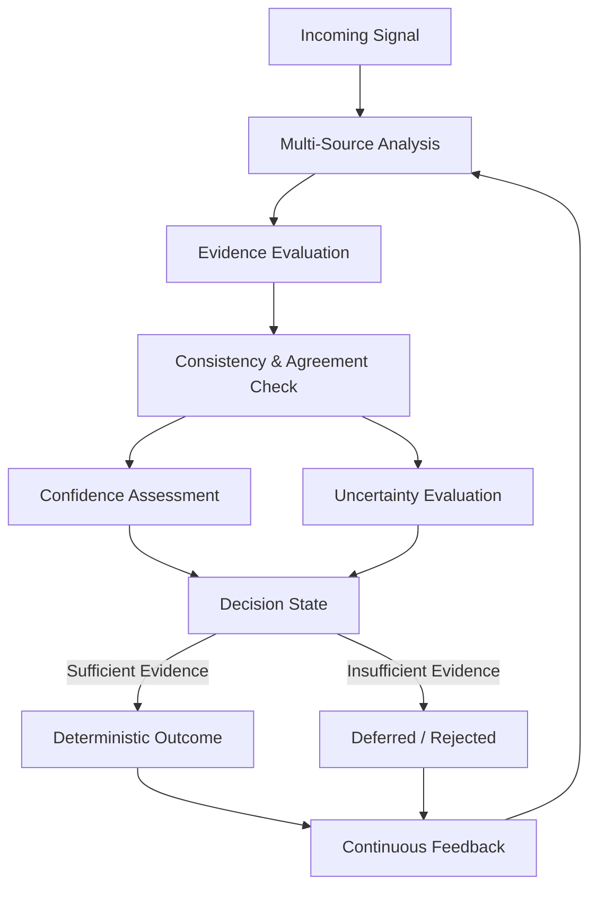

# Truthimatics: Evidence-Driven Determinism

## Overview

Truthimatics is a decision framework designed to move beyond probabilistic estimation toward **evidence-driven determinism**.

Traditional machine learning systems output confidence scores that often appear precise but lack grounded reliability. Truthimatics addresses this by enforcing a stricter standard: decisions are only issued when the system can justify them through **bounded uncertainty and multi-source agreement**.

The objective is not to maximize accuracy alone, but to ensure that every decision is **defensible, measurable, and constrained by known limits of uncertainty**. When those limits are not met, the system explicitly refuses to produce a verdict.

### Architectural Logic Flow

---

## From Confidence to Certainty

Truthimatics redefines how confidence is constructed and interpreted.

Instead of relying on a single model output, the framework treats confidence as the result of **structured evidence accumulation**. Multiple independent analytical processes contribute signals that are:

* Individually evaluated
* Cross-validated against each other
* Continuously calibrated against real-world outcomes

A decision is not considered valid unless these signals converge under strict internal consistency criteria.

---

## Core Concepts

### Uncertainty Awareness

Truthimatics distinguishes between different forms of uncertainty:

* **Irreducible uncertainty** arising from inherent noise in the data
* **Reducible uncertainty** caused by insufficient evidence or incomplete knowledge

The system explicitly tracks and manages both, ensuring that decisions are only made when uncertainty is sufficiently constrained.

---

### Evidence Convergence

Rather than averaging outputs, Truthimatics emphasizes **agreement across independent sources**.

Confidence emerges when:

* Multiple analytical processes reach consistent conclusions
* Weak or conflicting signals are filtered out
* Dependencies between signals are accounted for

This creates a system where agreement strengthens decisions, and disagreement delays them.

---

### Refusal as a First-Class Outcome

A defining property of Truthimatics is its ability to **withhold decisions**.

If evidence is insufficient, inconsistent, or unstable, the system does not degrade into guesswork. Instead, it explicitly returns a non-decision state, preserving reliability over coverage.

---

## System Behavior

Truthimatics operates as a continuous evaluation loop:

* Incoming signals are assessed relative to evolving reference distributions
* Independent analytical processes extract and validate evidence
* Relationships within the data are monitored for stability over time
* Confidence signals are calibrated against observed outcomes
* Decisions are issued only when all internal criteria for determinism are satisfied

The system continuously updates itself through feedback, ensuring that its internal models remain aligned with reality.

---

## Decision Model

Truthimatics produces structured outcomes that reflect both confidence and evidence quality:

* **Deterministic** — Strong agreement, tightly bounded uncertainty, and stable evidence
* **Probable** — Sufficient evidence for action, with controlled uncertainty
* **Uncertain** — Incomplete or conflicting signals; further analysis required
* **Weak** — Insufficient evidence to support a reliable conclusion
* **Reject** — Ambiguous or unresolvable input; no decision issued

These categories are not arbitrary thresholds, but the result of internal consistency checks across the entire system.

---

## Example (Conceptual)

Given a complex input signal:

* Multiple independent analyses are performed
* Each produces an evidence signal with associated reliability
* The system evaluates agreement, stability, and uncertainty bounds
* If convergence is achieved under strict criteria, a deterministic verdict is issued
* Otherwise, the system either delays the decision or rejects it entirely

---

## Core Guarantees

Truthimatics enforces a set of non-negotiable principles:

* **No single-source decisions** — conclusions require independent agreement
* **Calibrated confidence** — all outputs are aligned with observed correctness over time
* **Uncertainty-aware reasoning** — decisions are bounded by measurable limits
* **Adaptive behavior** — the system continuously updates based on new evidence
* **Drift sensitivity** — changes in underlying data distributions trigger re-evaluation
* **Failure transparency** — uncertainty results in explicit non-decisions, not hidden errors

---

## Design Philosophy

Truthimatics is built around a fundamental shift:

> The goal is not to always produce an answer,
> but to ensure that every answer produced is **justified, stable, and actionable**.

A system that knows when not to decide is more reliable than one that always does.

---

## Closing Note

Truthimatics is not a single model or algorithm.
It is a structured approach to building systems that:

* Understand the limits of their knowledge
* Require evidence before action
* And treat uncertainty as a measurable, controllable quantity

The result is a new class of systems defined not by how often they are correct,
but by how rigorously they **justify being correct**.
